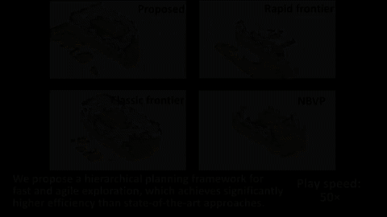

# FUEL

**FUEL** is a hierarchical framework for **F**ast **U**AV **E**xp**L**oration.
It contains a Frontier Information Structure (FIS), which can be incrementally updated with the online built map and facilitate exploration planning in high frequency.
Based on FIS, a hierarchical planner plans optimal global coverage paths, refine local viewpoints, and generates minimum-time local trajectories successively.  
Our method is demonstrated to complete challenging exploration tasks **3-8 times** faster than state-of-the-art approaches.

__Authors__: [Boyu Zhou](http://boyuzhou.net) and [Shaojie Shen](http://uav.ust.hk/group/) from the [HUKST Aerial Robotics Group](http://uav.ust.hk/).

<p align="center">
  
  
  
  
  <!--  -->
</p>

Complete videos: [video1](https://www.youtube.com/watch?v=_dGgZUrWk-8).

Please cite our paper if you use this project in your research:
- [__FUEL: Fast UAV Exploration using Incremental Frontier Structure and Hierarchical Planning__](https://arxiv.org/abs/2010.11561), Boyu Zhou, Yichen Zhang, Xinyi Chen, Shaojie Shen, IEEE Robotics and Automation Letters (**RA-L**) with ICRA 2021 option

```
@article{zhou2021fuel,
  title={FUEL: Fast UAV Exploration Using Incremental Frontier Structure and Hierarchical Planning},
  author={Zhou, Boyu and Zhang, Yichen and Chen, Xinyi and Shen, Shaojie},
  journal={IEEE Robotics and Automation Letters},
  volume={6},
  number={2},
  pages={779--786},
  year={2021},
  publisher={IEEE}
}
```

Please kindly star :star: this project if it helps you. We take great efforts to develope and maintain it :grin::grin:.


## Quick Start

This project is mostly based on [Fast-Planner](https://github.com/HKUST-Aerial-Robotics/Fast-Planner). 
It has been tested on Ubuntu 16.04(ROS Kinetic) and 18.04(ROS Melodic). Take Ubuntu 18.04 as an example, run the following commands to setup:

```
  sudo apt-get install libarmadillo-dev ros-melodic-nlopt
```

To simulate the depth camera, we use a simulator based on CUDA Toolkit. Please install it first following the [instruction of CUDA](https://developer.nvidia.com/zh-cn/cuda-toolkit). 

After successful installation, in the **local_sensing** package in **uav_simulator**, remember to change the 'arch' and 'code' flags in CMakelist.txt according to your graphics card devices. You can check the right code [here](https://github.com/tpruvot/ccminer/wiki/Compatibility). For example:

```
  set(CUDA_NVCC_FLAGS 
    -gencode arch=compute_61,code=sm_61;
  ) 
```

Finally, clone and compile our package:

```
  cd ${YOUR_WORKSPACE_PATH}/src
  git clone https://github.com/HKUST-Aerial-Robotics/FUEL.git
  cd ../ 
  catkin_make
```

After compilation you can start the visualization by: 

```
  source devel/setup.bash && roslaunch exploration_manager rviz.launch
```
and start a simulation (run in a new terminals): 
```
  source devel/setup.bash && roslaunch exploration_manager exploration.launch
```
You will find a cluttered scene to be explored (20m x 12m x 2m) and the drone in ```Rviz```. You can trigger the exploration to start by the ```2D Nav Goal``` tool. A sample simulation is shown in the figure. The unknown obstacles are shown in grey, while the frontiers are shown as colorful voxels. The planned and executed trajectories are also displayed.

 <p id="demo1" align="center">
  
 </p>


## Acknowledgements
  We use **NLopt** for non-linear optimization and use **LKH** for travelling salesman problem.
